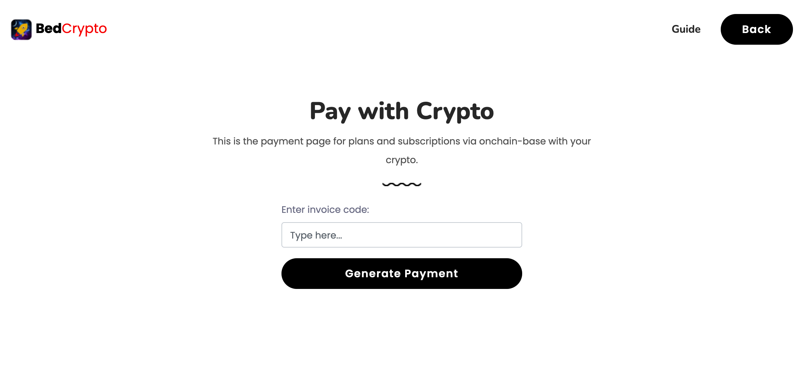
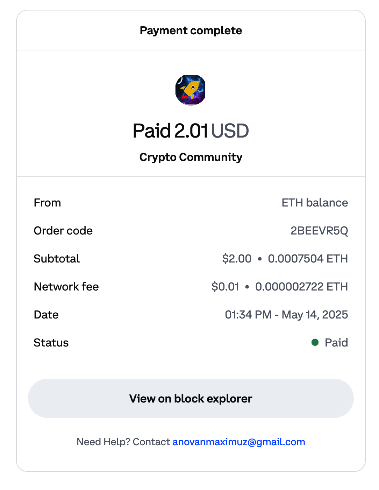

# Bedcrypto Pay Using Crypto - Base Commerce

This is the payment page option for plans and subscriptions via onchain-base with your from Crypto Community apps

## Users

## Powered by

## Preview

## FLow

- payment generate from Android app
- input invoice number and click pay
- if invoice exist you will redirected to coinbace ecommerce platform
- make payment as usual
- Coinbase send notification to webhook

## Project Implementation
https://devfolio.co/projects/bedcrypto-44cc

## History
- https://basescan.org/tx/0x3ecee25af1c03b7281ac537e9e25ec9caeb791b2eb7b0733b651fd5b8b4456ab
- https://commerce.coinbase.com/pay/071679f6-c432-4533-aa81-eb859d2936c0/receipt
  
## Contributing

Pull requests are welcome. For major changes, please open an issue first
to discuss what you would like to change. [Contribute](https://github.com/anovanmaximuz/bedcrypto-pay)

Please make sure to update tests as appropriate.

## License

[MIT](https://choosealicense.com/licenses/mit/)
